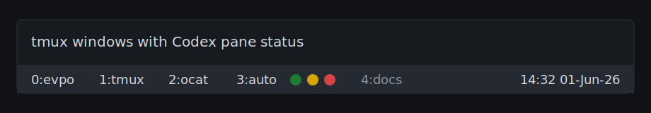
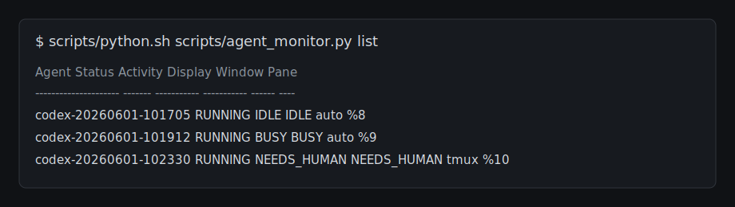

# codex-tmux-sentinel

A tmux plugin for showing Codex activity next to each tmux window name.

It tracks Codex sessions started through `agent-run`/`c`, stores live state in one locked JSON file, updates activity from native Codex hooks, and keeps tmux pane inference as a fallback. Each Codex pane gets one colored icon in the tmux window list.

## Screenshots

Demo video:

https://youtu.be/CmjLbY9gO0M

Per-window Codex icons:



State inspection:



## Display

Each Codex pane in a tmux window gets one icon after the window name, followed by the number of files under that pane's `idea` directory:

```text
auto ⬤ 12 ⬤ 0
```

Windows without Codex show no icon.

The number after each icon is the count of regular files under the pane's current `idea/` directory. This lets a project surface captured idea notes directly in the tmux window status.

Icon meanings:

- dark green `⬤`: idle, waiting at the Codex prompt
- yellow `⬤`: busy, processing prompt/tool work
- red `⬤`: needs human, failed, or approval-like state
- magenta `⬤`: busy work has not updated for the stall timeout

## Install

Copy-paste install:

```bash
git clone https://github.com/MartinKoubek/codex-tmux-sentinel ~/.tmux/plugins/codex-tmux-sentinel
~/.tmux/plugins/codex-tmux-sentinel/install.sh
```

Then reload your shell and start Codex with `c`:

```bash
source ~/.zshrc
c
```

`c` is the Codex shortcut installed by this plugin:

```text
before: codex
now:    c
```

If you already cloned this repository, run the installer from the repo:

```bash
./install.sh
```

The installer updates:

- `~/.zshrc`: adds plugin `bin` to `PATH` and defines `c`
- `~/.tmux.conf`: permanently loads `agent-monitor.tmux` on every tmux start/reload and sets recommended options
- `~/.codex/hooks.json`: installs Codex native hooks for activity updates
- current tmux session: reloads the plugin when run from inside tmux

The tmux install is persistent. `./install.sh` writes a managed block like this to `~/.tmux.conf`:

```tmux
# codex-tmux-sentinel begin
set -g @agent_monitor_window_icons on
set -g @agent_monitor_auto_window_names on
set -g @agent_monitor_window_name_len 4
set -g @agent_monitor_refresh_interval 1
run-shell "$HOME/.tmux/plugins/codex-tmux-sentinel/agent-monitor.tmux"
# codex-tmux-sentinel end
```

Skip the persistent tmux install with:

```bash
./install.sh --no-tmux
```

Installer options:

```bash
./install.sh --no-zsh
./install.sh --no-tmux
./install.sh --no-codex-hooks
ZSHRC=/path/to/.zshrc TMUX_CONF=/path/to/.tmux.conf ./install.sh
```

The installer adds managed Codex native hook commands to `~/.codex/hooks.json` by default. Hook events update the same monitor state as `agent-run`, and pane-based inference remains as a fallback. Use `--no-codex-hooks` only if you want status based on pane inference alone.

### With TPM

Add the plugin to `~/.tmux.conf`:

```tmux
set -g @plugin 'MartinKoubek/codex-tmux-sentinel'
run '~/.tmux/plugins/tpm/tpm'
```

Then press `prefix + I` inside tmux to install it.

TPM loads the tmux plugin, but it does not install the `c` shell shortcut. Add the command shims to your shell:

```bash
export PATH="$HOME/.tmux/plugins/codex-tmux-sentinel/bin:$PATH"
```

Or run the installer after TPM installs the plugin:

```bash
~/.tmux/plugins/codex-tmux-sentinel/install.sh
```

### Manual

Load the plugin from a local checkout:

```tmux
run-shell '~/.tmux/plugins/codex-tmux-sentinel/agent-monitor.tmux'
```

Add the command shims to your shell:

```bash
export PATH="$HOME/.tmux/plugins/codex-tmux-sentinel/bin:$PATH"
```

## Usage

Start Codex through the wrapper:

```bash
agent-run my-codex codex
```

The local `~/.zshrc` also defines `c`, so this works:

```bash
c
c resume
c help
c --agent my-codex
c --agent my-codex resume
```

Codex may ask you to review and trust the hook commands the first time it sees them. Start Codex with `c` so the hook events share the same `AGENT_ID` as the tmux monitor entry.

Manual state changes:

```bash
agent-status idle --agent my-codex
agent-status busy --agent my-codex
agent-status needs-human --agent my-codex --message "Need approval"
agent-status delete --agent my-codex
```

Inspect state:

```bash
scripts/python.sh scripts/agent_monitor.py list
while true; do clear; cat ~/.agent-monitor/codex-state.json; sleep 1; done
```

Clean completed/stopped agents:

```bash
scripts/python.sh scripts/agent_monitor.py prune
```

## Troubleshooting

If Codex prints hook failures like this:

```text
SessionStart hook (failed)
error: hook exited with code 127
```

you are running a Codex process that loaded an old hook config from a previous version of this plugin.

Fix:

1. Exit the affected Codex session.
2. Run `./install.sh` once to remove any old managed hook block from `~/.codex/config.toml`.
3. Start Codex again with `c`.

You can confirm the active config is clean with:

```bash
rg 'codex-hook|agent-monitor codex hooks' ~/.codex/config.toml
```

That command should print nothing.

Codex native hooks are installed by default. To skip them during install, run:

```bash
./install.sh --no-codex-hooks
```

If hooks are not firing, start a new Codex session with `c` after reinstalling and accept the hook trust prompt if Codex shows one.

## tmux Options

```tmux
set -g @agent_monitor_home "$HOME/.agent-monitor"
set -g @agent_monitor_stall_timeout "600"
set -g @agent_monitor_window_icons "on"
set -g @agent_monitor_auto_window_names "on"
set -g @agent_monitor_window_name_len "4"
set -g @agent_monitor_refresh_interval "1"
```

`@agent_monitor_auto_window_names` renames tmux windows from the first pane's current path. Generic path names such as `src`, `lib`, `common`, `app`, and `scripts` are skipped, then the selected segment is shortened to `@agent_monitor_window_name_len` characters.

Example:

```text
/Users/martinkoubek/martinkoubek/ocat-local -> ocat
```

## Files

- `agent-monitor.tmux`: tmux plugin entrypoint
- `scripts/agent-run`: registers and runs an agent command
- `scripts/agent-status`: manual state updates
- `scripts/codex-hook`: Codex native hook entrypoint
- `scripts/agent_monitor.py`: locked state file, hook updates, activity inference, and icon rendering
- `scripts/window-status.sh`: renders per-window icons
- `scripts/window-name.sh`: auto-renames windows from pane paths
- `bin/agent-run`, `bin/agent-status`: PATH-friendly shims
